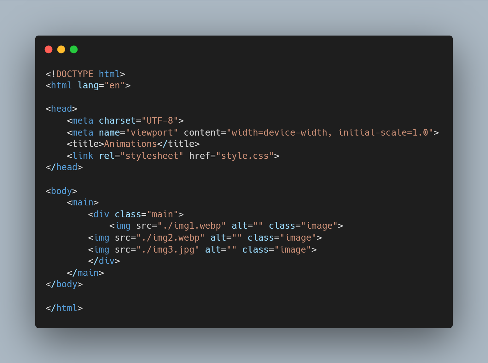
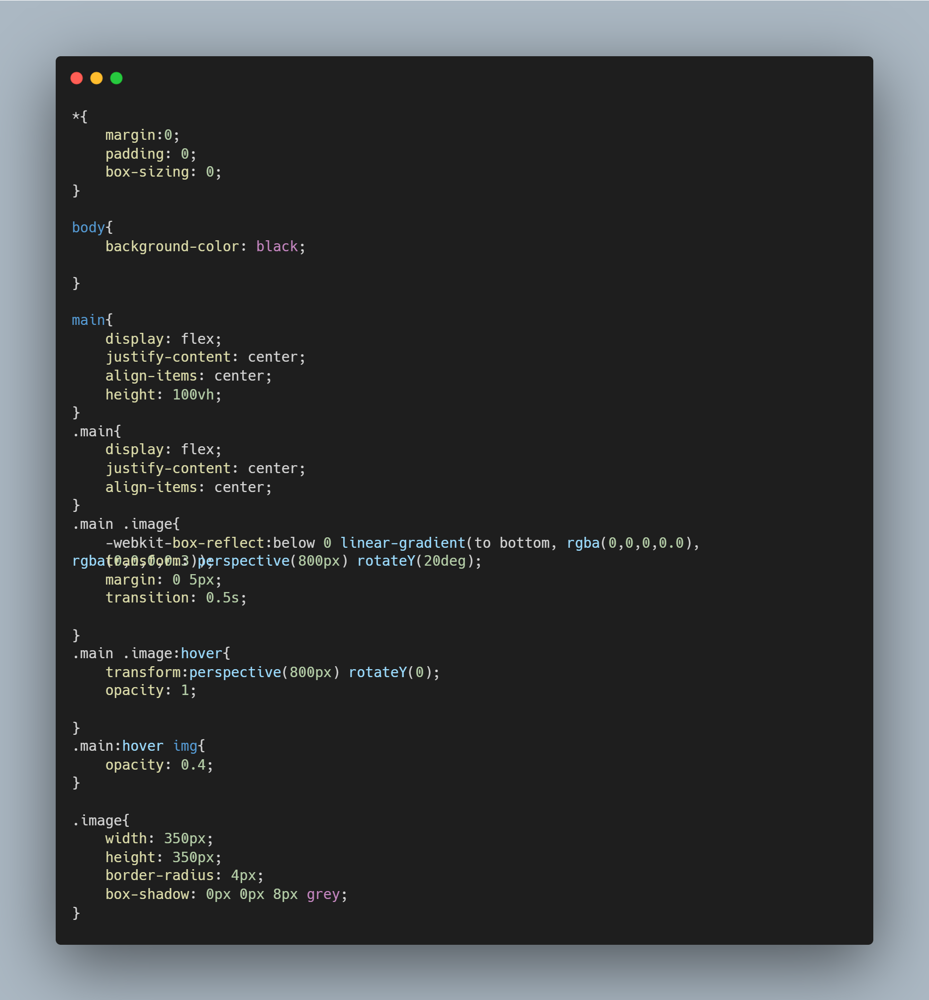

# Animations

## [Hosted Link!](https://hsc92180.github.io/Geekster_Assignment/Animations/)

### HTML File:

This is index.html file. We use Link tag in head to connect css file with html file.
rel -> attribute tell about type of sheet we are calling and href -> attribute gives address of file.
In body, I have used main, div, img tags with appropriate css styling.

### CSS File:

universal, class, and tag selector used in css.  
In css styling, common properties have been used as:  
margin -> used for giving space between two elements. 
padding -> used for giving space between content and border of the element. 
box-sizing -> property used for styling box like container for body. 
color -> used for giving color of text. 
border -> used for giving style to border. There are many propereties for border like border-style border-radius.  
background properties -> used for styling backgrund like color, etc. 
border-radius -> cornering the element border using it. 
webkit-box-reflect -> used for giving reflection properties.  
transform -> used to rotate image towards the screen.  
hover -> psedo selector is used for making those animations.  
The image also contains the transform property, if hovered then the image get back to 0 deg as to screen.  