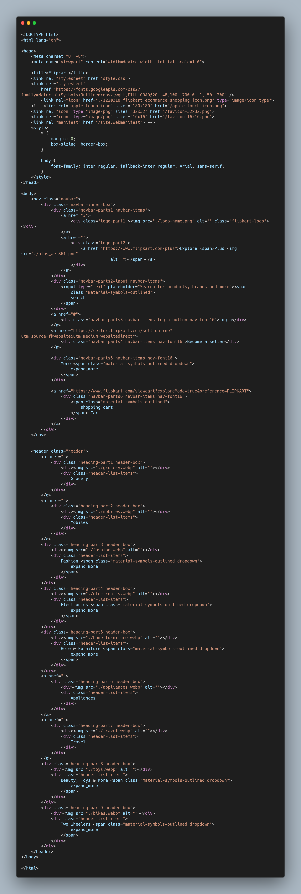
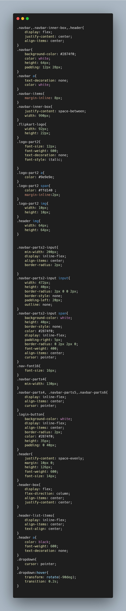

# Flipkart Navbar

## [Hosted Link!](https://hsc92180.github.io/Geekster_Assignment/Flipkart/)

### HTML File:

This is index.html file. We use Link tag in head to connect css file with html file.
rel -> attribute tell about type of sheet we are calling and href -> attribute gives address of file.
In body, I have used div, nav, header, a, span tags with appropriate css styling.

### CSS File:

universal, class, and tag selector used in css.  
In css styling, common properties have been used as:  
margin -> used for giving space between two elements. 
padding -> used for giving space between content and border of the element. 
box-sizing -> property used for styling box like container for body. 
color -> used for giving color of text. 
border -> used for giving style to border. There are many propereties for border like border-style border-radius.  
font-size -> used for giving size to the font.  
text-align -> used for aligning the text in a box/container right, left or center. 
border-radius -> cornering the element border using it. 
display as flex -> property of display and related properties like justify-content, align-items have used for styling.
