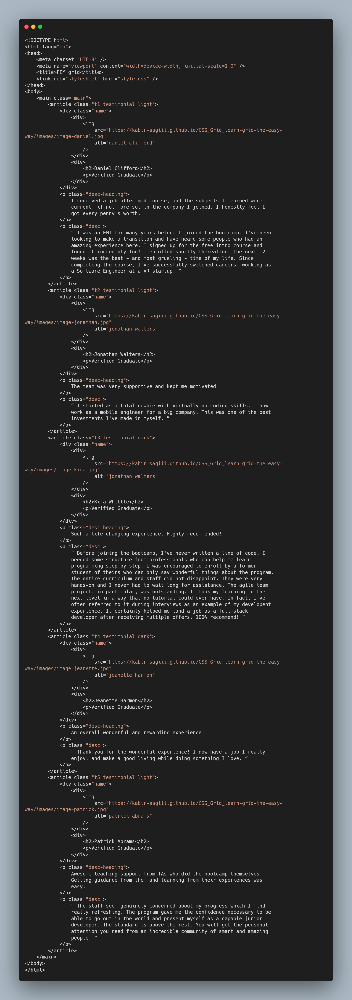
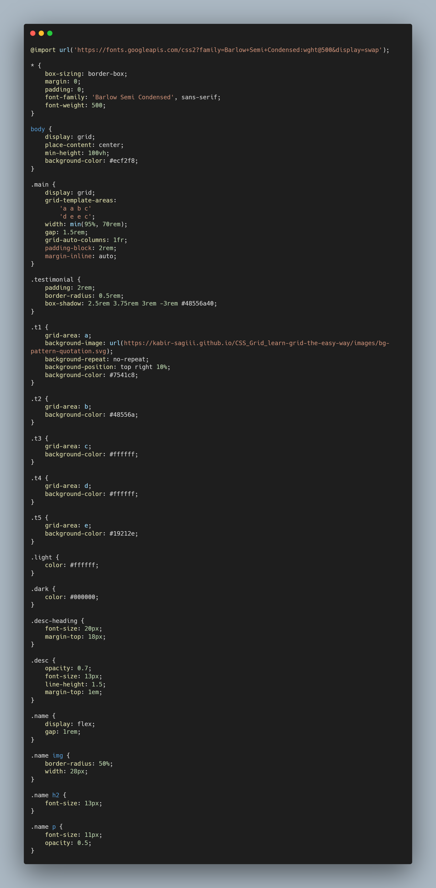

# Grid Template

## [Hosted Link!](https://hsc92180.github.io/Geekster_Assignment/Grid-Template/)

### HTML File:

This is index.html file. We use Link tag in head to connect css file with html file.
rel -> attribute tell about type of sheet we are calling and href -> attribute gives address of file.
In body, I have used nain, article, div, p tags with appropriate css styling.

### CSS File:

universal, class, and tag selector used in css.  
In css styling, common properties have been used as:  
margin -> used for giving space between two elements. 
padding -> used for giving space between content and border of the element. 
box-sizing -> property used for styling box like container for body. 
color -> used for giving color of text. 
border -> used for giving style to border. There are many propereties for border like border-style border-radius.  
background properties -> used for styling backgrund like color, image, position, repeat, etc. 
font-size -> used for giving size to the font.  
border-radius -> cornering the element border using it. 
display as grid -> property of display.  
grid-template-area -> specifies areas within the grid layout.  
grid-auto-columns -> sets a size for the columns in a grid container.  
gap -> defines the size of the gap between the rows and between the columns in flexbox, grid or multi-column layout.  