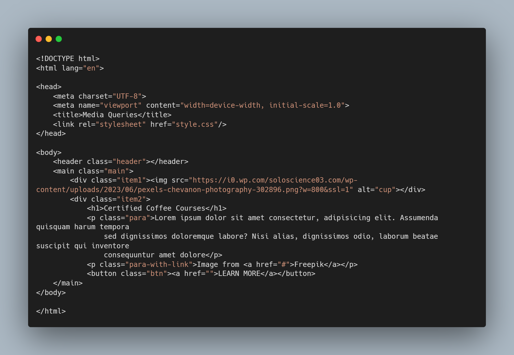
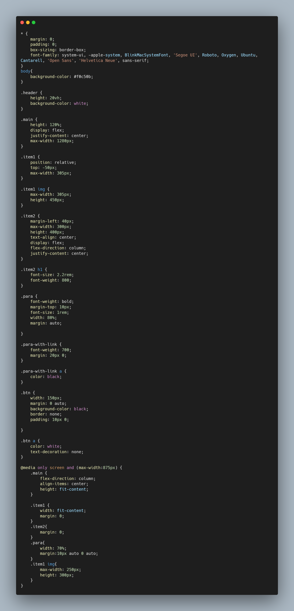

# Animations

## [Hosted Link!](https://hsc92180.github.io/Geekster_Assignment/Media-Queries/)

### HTML File:

This is index.html file. We use Link tag in head to connect css file with html file.
rel -> attribute tell about type of sheet we are calling and href -> attribute gives address of file.
In body, I have used main, div, h1, p, button tags with appropriate css styling.

### CSS File:

universal, class, and tag selector used in css.  
In css styling, common properties have been used as:  
margin -> used for giving space between two elements. 
padding -> used for giving space between content and border of the element. 
box-sizing -> property used for styling box like container for body. 
color -> used for giving color of text. 
border -> used for giving style to border. There are many propereties for border like border-style border-radius.  
background properties -> used for styling backgrund like color, etc. 
border-radius -> cornering the element border using it. 
It is created using media query, in which the size of the image and the flex-direction of the main container have been fixed for small screen size.  
In max-screen size the flex direction is set to row-wise.  
In min-screen size the flex direction is set to column-wise.  
There is a header with white strip and the image is set to overlay on the header.  
Position: relative, and top: , have been used for fixing the some part of the image to the header.  